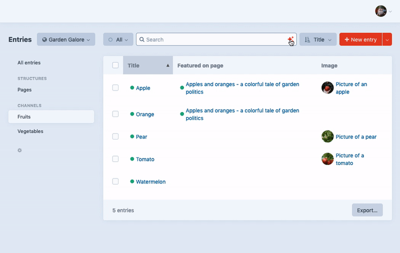

# Easy Search plugin for Craft CMS 3.x

Craft's search functionality, powerful as it may be, is not as end user friendly as you'd like it to be. With Easy Search, your content editors can use predefined search queries ("search for all entries with an image field that's not empty") or build their own search query with a user friendly GUI.

### :warning: **This plugin will not be released for Craft 4
We believe that native element index filtering options in Craft 4, in addition to having the ability to create [custom sources](https://craftcms.com/docs/4.x/entries.html#custom-sources) with filtering applied, makes our plugin obsolete.



## Requirements

This plugin requires Craft CMS 3.0.0 or later.

## Installation

To install the plugin, follow these instructions.

1. Open your terminal and go to your Craft project:

        cd /path/to/project

2. Then tell Composer to load the plugin:

        composer require nilsenpaul/craft-easy-search

3. In the Control Panel, go to Settings → Plugins and click the “Install” button for Easy Search.

## Configuring Easy Search (optional)

If you want to be able to use predefined search queries with Easy Search, create a file in Craft's `config` folder, named `easy-search.php`. In this file, you'd add the following:

```
<?php

return [
  'queries' => [
    [
      'query' => 'title:*',
      'label' => 'All items with a title',
      'element' => 'craft\\elements\\Entry', // This is optional, and will make Easy Search only show this query on the Entries element index
      'source' => 'section:3ae083f5-a8c8-4506-b0cb-3f6469bd254d', // Using the UID of a source (prepended by "section:", "group:" or "folder:"), you can limit a predefined query to certain element sources
    ],
    [
      'query' => 'image:*',
      'label' => 'All items with an image',
    ],
    [
      'query' => '-image:*',
      'label' => 'All items without an image',
    ],
  ]
];
```

Brought to you by [nils&paul](https://nilsenpaul.nl)
